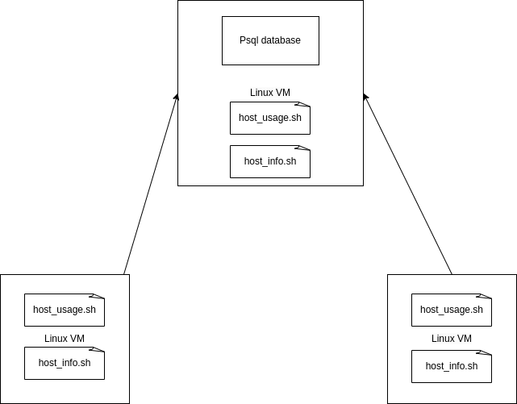

# Introduction
This project monitors the ressource usage of Linux virtual machines running on Google Cloud. The intended users are the Jarvis Linux Cluster Administration team. The application is written in Linux Bash. One of the Linux machines is selected to host the database, which runs Postgresql in Docker. The database contains two tables, one for the hardware information, another for the usage information, which are create with a ddl.sql file. Three bash scripts are used: one is only used on the machine that hosts the database, the other two runs on each machine. host_info.sh runs once and collects information about the machine hardware, while host_usage.sh runs every minute (triggered by crontab) and sends information such as memory usage, disk usage, and CPU usage to the database.

# Quick Start
Use markdown code block for your quick-start commands
- Start a psql instance using psql_docker.sh. You can use `postgres` and `password` as username and password
  `./psql_docker.sh create YOUR_USERNAME_HERE YOUR_PASSWORD_HERE`
  If there is already a container, you can start it by using
  `./psql_docker start`
- Create tables using ddl.sql, if the tables do not already exist
  `psql -h localhost -U postgres -d host_agent -f sql/ddl.sql`
- Insert hardware specs data into the DB using host_info.sh. NOTE: this is a setup with one VM. If multiple VMs are used,
  replace `localhost` with the public IP of the VM that hosts the database
  `./host_info.sh "localhost" 5432 "host_agent" YOUR_USERNAME_HERE YOUR_PASSWORD_HERE`
- Insert hardware usage data into the DB using host_usage.sh. NOTE: this is a setup with one VM. If multiple VMs are used,
  replace `localhost` with the public IP of the VM that hosts the database
  `./host_usage.sh "localhost" 5432 "host_agent" YOUR_USERNAME_HERE YOUR_PASSWORD_HERE`
- Crontab setup: use the following command to make the script `host_usage.sh` run every 1 minute (source:https://stackoverflow.com/a/878647/11627201)
  `crontab -l > mycron; echo "* * * * * bash /path/to/host_usage.sh localhost 5432 host_agent YOUR_USERNAME_HERE YOUR_PASSWORD_HERE > /tmp/host_usage.log" >> mycron && crontab mycron && rm mycron`

# Implementation
Discuss how you implement the project.

## Architecture

## Scripts
Shell script description and usage (use markdown code block for script usage)
- psql_docker.sh: this script manages the docker container named `jrvs-psql` which manages the database.
  - `create YOUR_USERNAME_HERE YOUR_PASSWORD_HERE`:
    - this command creates a container `jrvs-psql` and allows the user to connect to the database inside the container with YOUR_USERNAME_HERE and YOUR_PASSWORD_HERE. If the container is already created, the script exits with an error.
  - `stop`:
    - stops the container if it is running
  - start:
    - starts the container if it is stopped
- host_info.sh: this script runs once, and sends the following information about the VM to the database:
  - the name of the VM
  - the number of CPUs
  - the CPU architecture
  - the CPU model
  - the clockspeed in MHz
  - the amount of L2 cache in KB
  - the time this information was collected 
  - the amount of total memory (RAM) in KB
  To run the script, use the following command:
  - `./host_info.sh "localhost" 5432 "host_agent" YOUR_USERNAME_HERE YOUR_PASSWORD_HERE`

- host_usage.sh: this script collects the following information about the host VM every minute and sends it to the database:
  - timestamp (time which this information was taken, in format of yyyy-mm-dd HH:MM:SS)
  - the id of the host machine
  - the amount of free RAM in MB
  - the percentage of time the CPU is idle
  - the percentage of time where the CPU runs kernel code
  - the number of current I/O operations
  - the amount of free/available disk, in MB. To run the script, use the following command
  To run the script, use the following command: 
  - `./host_usage.sh "localhost" 5432 "host_agent" YOUR_USERNAME_HERE YOUR_PASSWORD_HERE`

- crontab: this is a Linux tool to automatically run a script at a specified interval.
  In this case, we want to run `host_usage.sh`
  - `./host_info.sh "localhost" 5432 "host_agent" YOUR_USERNAME_HERE YOUR_PASSWORD_HERE`
- ddl.sql: this script connects to the database hosts_agent, and creates the tables
  host_info and host_usage if the tables are not created yet.
  - `psql -h localhost -U postgres -d host_agent -f sql/ddl.sql`

## Database Modeling
Describe the schema of each table using markdown table syntax (do not put any sql code)
- `host_info`
  |Attribute        |description|
  |-----------------|-----------|
  |id               | ID that identifies the VM, auto-assigned and serves as primary key|
  |hostname         | name of the VM, must be unique for each vm|
  |cpu_number       | number of CPUs|
  |cpu_architecture | CPU architecture|
  |cpu_model        | CPU model|
  |cpu_mhz          | COU clock speed (in MHz)|
  |l2_cache         | l2 Cache in KB|
  |timestamp        | time when the host info was taken|
  |total_mem        | total available RAM|
- `host_usage`
  |Attribute        |description|
  |-----------------|-----------|
  |timestamp        | time when the host usage was taken|
  |host_id          | id of the VM that runs the script, serves as a foreign key pointing to a row in host_info |
  |memory_free      | amount of free RAM (MB)|
  |cpu_idle         | percentage of time the CPU is idle|
  |cpu_kernel       | percentage of time the CPU is running kernel code|
  |disk_io          | number of current IO operations|
  |disk_available   | available disk space in MB|

# Test
The bash scripts were tested locally by running each commands individually, to make sure that they have the right output.

# Deployment
The app is deployed on Google Cloud. One VM is chosen to host the database server, which runs inside a Docker container. All VMs involved will:
1. Send the hardware information and the host name to the database once
2. Every minute, they will send the usage info to the database; the job is triggered by crontab.

# Improvements
The following things can be improved in the future:
1. All manual steps can be automated with `gcloud` with a `.sh` script that runs the users' laptop, which would be responsible for deploying the Docker container on the VM that hosts the Postgresql database and sending the right scripts to each VM (could be a CD/CI pipeline on Gitlab).
2. If the VM with the Docker container on it crashes, we lose all the data. It would be a great idea to back it up somewhere, could be in another region
3. For the host_usage table, we can use the host name and the timestamp as a primary key for easier access.
4. More customizability can be added (e.g. let the user choose the container name)